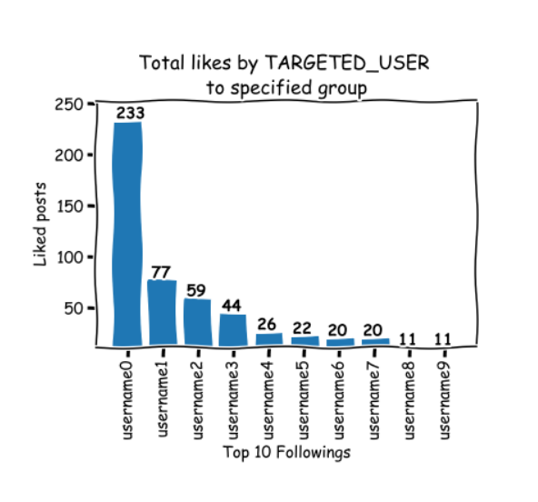

# WhoSheLikes 

### Purpose:

This Juputer Notebook will count all likes of a specified user for particular group of people sorted by your list of names.
You can use male/female names or any other wordlist to find followings of a user and then all likes they have from that user.

To try it online:
https://mybinder.org/v2/gh/VoltK/WhoSheLikes/master

### Final Result:

### Note:

if you don't specify path yo your namelist by default it will be set to *male_names.txt* (Mostly Russian names)

